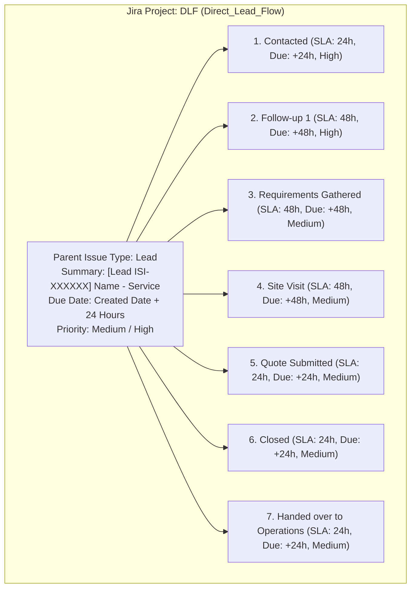

# ISI Security (ISI V2) – Master Lead Capture, Jira Integration & Form Architecture Documentation

> **Document Version:** 2.1  
> **Repository:** ISI V2 (`isi-v2.vercel.app` / `www.isisecurity.in`)  
> **Jira Cloud Project:** `DLF` (Direct_Lead_Flow)  
> **Google Sheets Webhook:** `AppsScript_Webhook.js`  

---

## 1. Master Matrix: Which Leads are Captured in Jira vs Google Sheets

This master reference table details every lead type across the ISI V2 website, where it originates, and its exact destination in Jira Cloud and Google Sheets.

| # | Lead Type / Form Category | Website Page / Trigger | Google Sheet Tab Destination | Captured in Jira DLF? | Jira Issue Type & Workflow |
| :---: | :--- | :--- | :--- | :---: | :--- |
| **1** | **General B2B Security Leads** | All service, industry & home pages via floating **"Get in Touch"** button & navbar **"Get a Quote"** | `LEADS` & `Global_Lead_Form` | ✅ **YES** | Parent **`Lead`** (`DLF-XX`) + **7 Subtasks** |
| **2** | **Enterprise Sales & Facility Management** | `/lp/facility-management`, `/integratedservices`, `/salesinquiry` | `Sales_Inquiries` & `LEADS` | ✅ **YES** | Parent **`Lead`** (`DLF-XX`) + **7 Subtasks** |
| **3** | **Direct Website Contact Inquiries** | `/contact` | `Contact_Form` & `LEADS` | ✅ **YES** | Parent **`Lead`** (`DLF-XX`) + **7 Subtasks** |
| **4** | **Campus & School Safety Consultations** | `/solutions/school-safety`, `/solutions/campus-safety` | `Consultation_Requests` & `LEADS` | ✅ **YES** | Parent **`Lead`** (`DLF-XX`) + **7 Subtasks** |
| **5** | **Government & Enterprise Tenders / RFQ** | Tender RFQ Form | `Tender_RFQ` & `LEADS` | ✅ **YES** | Parent **`Lead`** (`DLF-XX`) + **7 Subtasks** |
| **6** | **AI Interactive Chatbot Leads** | Main Website Interactive Bot (`useChatBot.ts`) | `Chatbot_Leads` & `LEADS` | ✅ **YES** | Parent **`Lead`** (`DLF-XX`) + **7 Subtasks** |
| **7** | **Channel Partner Network Applications** | `/partners` | `Partner_Applications` | ❌ **NO (Excluded)** | Routed to Strategic Alliances CRM Sheet & Partner Email Desk |
| **8** | **ISI Academy AI Chatbot Inquiries** | `/academy` (`ISIAcademyChatbot.tsx`) | `Academy_Inquiries` & `ACADEMY_LEADS` | ❌ **NO (Excluded)** | Routed to Academic Advisory CRM Sheet & Academy Email Desk |
| **9** | **Training Course Registrations** | `/courses` | `TRAINING` & `Academy_Inquiries` | ❌ **NO (Excluded)** | Routed to Training Operations CRM Sheet & Academic Desk |
| **10** | **Career & Job Applications** | `/career`, `/careers` | `Career_Applications` | ❌ **NO (Excluded)** | Routed to HR Talent Acquisition Google Drive + HR Email Digest |
| **11** | **Ebook & Safety Whitepaper Downloads** | Landing Pages Resource Sections | `Ebook_Downloads` | ❌ **NO (Excluded)** | Automated content delivery + Marketing Nurture CRM Sheet |

---

## 2. Detailed Breakdown: Which Leads ARE Captured in Jira

All commercial, guarding, and facility management business inquiries are routed to Jira Cloud for immediate operational fulfillment.

### A. Jira Parent Issue Specifications
- **Jira Project Key:** `DLF`
- **Parent Issue Type:** `Lead` (id: `10289`, hierarchyLevel: 1)
- **Summary:** `[Lead ISI-XXXXXX] {Full Name} - {Service Requirement}`
- **Dynamic Due Date:** Automatically calculated as `Created Date + 24 Hours` (`YYYY-MM-DD`).
- **Normalized Source:** Standardized into one of 6 categories:
  1. `Google Ads`
  2. `YouTube`
  3. `Meta / FB`
  4. `Affiliate Site`
  5. `Organic`
  6. `Community`
- **ADF Formatted Description:** Includes Full Name, Work Email, Phone Number, Company/Organization, Service Requirement, Lead Tracking Number, Due Date, Normalized Source, Page URL, Page Title, IP Address, and Geographic Location.

### B. The 7 Automated Subtasks & Workflow SLAs
When the parent `Lead` issue is created, the system immediately generates **7 child subtasks** (`issuetype: "Task"`, linked with `parent: { key: parentKey }`):

| Subtask # | Task Name | SLA Timeframe | Due Date Calculation | Priority | Purpose |
| :---: | :--- | :---: | :---: | :---: | :--- |
| **1** | **Contacted** | 24 Hours | Created Date + 24h | `High` | Initial phone call or email outreach within SLA window. |
| **2** | **Follow-up 1** | 48 Hours | Created Date + 48h | `High` | Second outreach touchpoint if initial contact was unreached. |
| **3** | **Requirements Gathered** | 48 Hours | Created Date + 48h | `Medium` | Security audit, manpower count, equipment needs gathered. |
| **4** | **Site Visit** | 48 Hours | Created Date + 48h | `Medium` | Field security survey, post layout, and perimeter risk assessment. |
| **5** | **Quote Submitted** | 24 Hours | Created Date + 24h | `Medium` | Formal enterprise proposal, rate card, and SLA pricing shared. |
| **6** | **Closed** | 24 Hours | Created Date + 24h | `Medium` | Contract signed, NDA executed, commercial agreement finalized. |
| **7** | **Handed over to Operations** | 24 Hours | Created Date + 24h | `Medium` | Guard deployment, uniform issuance, command center onboarding. |

---

## 3. Detailed Breakdown: Which Leads are EXCLUDED from Jira & Why

To ensure operational efficiency, non-guarding submissions are strictly filtered out of the Jira `DLF` board and routed to dedicated databases:

| Excluded Form Category | Reason for Jira Exclusion | Where the Data Goes Instead |
| :--- | :--- | :--- |
| **Career Applications & Resumes** | Job candidates and guard applicants must not clutter the enterprise B2B sales pipeline. | • Google Sheet tab: `Career_Applications` • Resumes saved to Google Drive (`ISI_Career_Resumes`) • Automated HR notification & monthly candidate digest email. |
| **ISI Academy AI Chatbot Inquiries** | Student inquiries and professional course requests belong to the Academic division. | • Google Sheet tab: `Academy_Inquiries` / `ACADEMY_LEADS` • Automated notification to the Academic Director desk (`academy@isisecurity.in`). |
| **Training Course Registrations** | Course sign-ups on `/courses` follow an academic enrollment cycle. | • Google Sheet tab: `TRAINING` • Automated notification to Training Operations. |
| **Channel Partner Applications** | Vendor and partnership requests belong to Strategic Alliances. | • Google Sheet tab: `Partner_Applications` • Dedicated partner evaluation workflow. |
| **Newsletter & Exit Intent Feedback** | Passive feedback and marketing subscriptions are non-sales metrics. | • Google Sheet tabs: `Newsletter_Subscriptions`, `Exit_Intent_Feedback` • Handled by traffic and retention analytics. |

---

## 4. Detailed Breakdown: Which Leads ARE Captured in Google Sheets

All website submissions across all 11 categories are captured into specific standardized tabs in Google Sheets via `AppsScript_Webhook.js`.

### A. Primary Lead Tabs in Google Sheets

#### 1. `LEADS` & `Global_Lead_Form` (Enterprise & General Business Leads)
- **Source:** Global Floating Lead Form, Header "Get a Quote", General landing pages.
- **Columns (18):**
  `Lead Number` | `Name` | `Email` | `Phone` | `Requirement` | `Company` | `Page` | `Source` | `UTM Source` | `UTM Medium` | `UTM Campaign` | `UTM Term` | `UTM Content` | `Jira Issue Key` | `Jira Status` | `Timestamp` | `IP Location` | `IP Address`

#### 2. `Academy_Inquiries` & `ACADEMY_LEADS` (Academic & Course Leads)
- **Source:** ISI Academy AI Chatbot (`/academy`), Academy consultation forms.
- **Columns (21):**
  `Lead Number` | `Name` | `Email` | `Phone` | `Program / Course` | `Organization` | `Role` | `Experience` | `Learning Goal` | `Message` | `Source` | `UTM Source` | `UTM Medium` | `UTM Campaign` | `UTM Term` | `UTM Content` | `Status` | `IP Location` | `IP Address` | `Variant` | `Timestamp`

#### 3. `Career_Applications` (Job Applicants & Guard Recruitment)
- **Source:** `/career` & `/careers` application forms.
- **Columns (18):**
  `Name` | `Email` | `Phone` | `Job Title` | `Resume File Name` | `Resume Drive Link` | `Drive File ID` | `Cover Letter` | `UTM Source` | `UTM Medium` | `UTM Campaign` | `UTM Term` | `UTM Content` | `Status` | `IP Location` | `IP Address` | `Variant` | `Timestamp`

#### 4. `TRAINING` (Corporate & Professional Training Registrations)
- **Source:** `/courses` enrollment forms.
- **Columns (12):**
  `Name` | `Email` | `Phone` | `Program / Course` | `Organization` | `Experience` | `Source` | `UTM Source` | `UTM Medium` | `UTM Campaign` | `Timestamp` | `Status`

#### 5. `Sales_Inquiries` (Integrated Services & Large Facilities)
- **Source:** `/lp/facility-management`, `/integratedservices`, `/salesinquiry`.
- **Columns (16):**
  `Lead Number` | `Full Name` | `Phone Number` | `Work Email` | `Company Name` | `UTM Source` | `UTM Medium` | `UTM Campaign` | `UTM Term` | `UTM Content` | `Jira Issue Key` | `Jira Status` | `IP Location` | `IP Address` | `Variant` | `Timestamp`

#### 6. `Contact_Form` (Direct Inquiries)
- **Source:** `/contact` page.
- **Columns (21):**
  `Lead Number` | `Name` | `Email` | `Phone` | `Requirement` | `Company` | `Designation` | `Message` | `Source` | `UTM Source` | `UTM Medium` | `UTM Campaign` | `UTM Term` | `UTM Content` | `Jira Issue Key` | `Jira Status` | `Status` | `IP Location` | `IP Address` | `Variant` | `Timestamp`

#### 7. `Partner_Applications` (Channel Partner Network)
- **Source:** `/partners` page.
- **Columns (21):**
  `Lead Number` | `Name` | `Email` | `Company` | `Designation` | `Phone` | `Location` | `Partnership Type` | `Message` | `UTM Source` | `UTM Medium` | `UTM Campaign` | `UTM Term` | `UTM Content` | `Jira Issue Key` | `Jira Status` | `Status` | `IP Location` | `IP Address` | `Variant` | `Timestamp`

#### 8. `Consultation_Requests` (Institutional & Campus Security)
- **Source:** `/solutions/school-safety`, `/solutions/campus-safety`.
- **Columns (21):**
  `Lead Number` | `Name` | `School Name` | `Board` | `Number of Students` | `Primary Concern` | `Email` | `Phone` | `City` | `UTM Source` | `UTM Medium` | `UTM Campaign` | `UTM Term` | `UTM Content` | `Jira Issue Key` | `Jira Status` | `Status` | `IP Location` | `IP Address` | `Variant` | `Timestamp`

#### 9. `Tender_RFQ` (Tenders & RFQs)
- **Source:** Tender inquiry modals.
- **Columns (18):**
  `Lead Number` | `Name` | `Email` | `Phone` | `Organization` | `Tender Scope` | `Budget` | `Deadline` | `Message` | `UTM Source` | `UTM Medium` | `UTM Campaign` | `UTM Term` | `UTM Content` | `Jira Issue Key` | `Jira Status` | `Status` | `Timestamp`

#### 10. `Chatbot_Leads` (AI Chatbot Inquiries)
- **Source:** Website interactive assistant (`useChatBot.ts`).
- **Columns (17):**
  `Name` | `Email` | `Phone` | `Existing Customer` | `Category` | `Message` | `UTM Source` | `UTM Medium` | `UTM Campaign` | `UTM Term` | `UTM Content` | `Status` | `IP Location` | `IP Address` | `Organization` | `Variant` | `Timestamp`

---

## 5. Complete Record of Updates Made to ISI V2

1. **Sequential Lead Numbering Starting from `1` (`ISI-000001`)**:
   - Initialized consecutive lead sequence counter starting from `1` with 6-digit zero-padding (`ISI-000001`, `ISI-000002`) in `src/utils/leadNumber.ts`.
   - Persisted across user sessions in `localStorage`.

2. **Removal of Duplicate "Request Consultation" Text & Modals**:
   - Cleaned all duplicate and confusing consultation popups across the site.
   - Standardized CTA labels to `"Get a Quote"` and `"Get in Touch"`.

3. **Global Floating Lead Form (`FloatingLeadForm.tsx`)**:
   - Compact 4-field modal: Full Name, Work Email, Phone Number, and Service Requirement.
   - Auto-captures hidden attribution (Lead Number, Page URL, Title, Source, UTMs, Timestamp, IP, Location).

4. **Route Exclusions in `FloatingCTA.tsx`**:
   - Automatically hides the floating form on `/academy` (uses Academy Chatbot), `/career` (uses career application form), `/courses` (training flow), and `/lp/facility-management` (dedicated form).

5. **Header "Get a Quote" Standardized in `Header.tsx`**:
   - Desktop and mobile navbar "Get a Quote" buttons trigger the simple lead modal directly.

6. **Vite Development Jira Proxy Middleware in `vite.config.ts`**:
   - Added `jiraApiPlugin` to handle `POST /api/jira` during `npm run dev`, enabling live Jira ticket and subtask creation in local and production environments without 404 errors.

7. **Google Apps Script Webhook Hardened (`AppsScript_Webhook.js`)**:
   - Removed old developer names and triggers.
   - Added `clearAllProjectTriggers()`, `setupAllTriggers()`, and `INITIALIZE_ALL_SHEET_TABS_AND_HEADERS()`.
   - Updated all dashboard KPI and QUERY formulas to use standardized database names (`Traffic_Analytics`, `LEADS`, `Academy_Inquiries`, etc.).

8. **Zero-Error Production Build**:
   - Validated complete repository with Vite production bundler (`npm run build`) with **0 TypeScript and 0 bundler errors**.
