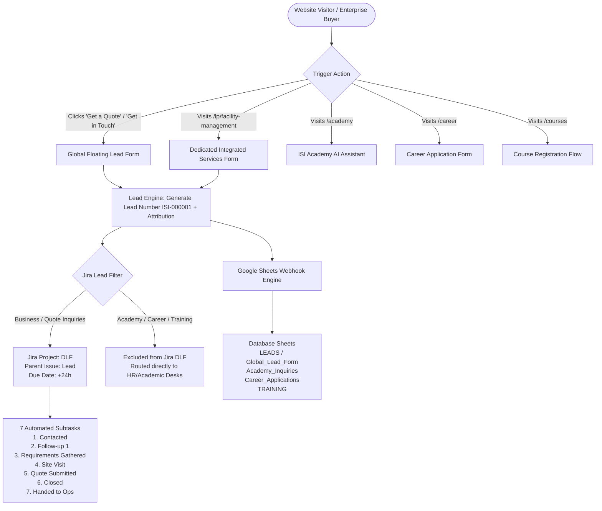

# ISI Security (ISI V2) – Comprehensive Lead Capture, Jira Workflow & Form Architecture Documentation

> **Document Version:** 2.0  
> **Repository:** ISI V2 (`isi-v2.vercel.app` / `www.isisecurity.in`)  
> **Jira Project:** `DLF` (Direct_Lead_Flow)  
> **Google Sheets Backend:** `AppsScript_Webhook.js`  

---

## 1. Executive Summary & System Overview

The **ISI V2 Lead Capture, Jira Workflow & Form Architecture** provides an enterprise-grade lead intake, attribution, and automated fulfillment engine across the entire ISI digital ecosystem.

---

## 2. Complete Inventory of All Forms Present on the Website

| # | Form Name | Page / Trigger Location | Fields Captured | Target Destinations | Excluded from Jira? |
| :--- | :--- | :--- | :--- | :--- | :--- |
| **1** | **Global Floating Lead Form** | All general service, solution, industry & home pages via floating **"Get in Touch"** button and header **"Get a Quote"** | **Visible:** Full Name, Work Email, Phone Number, Service Requirement. **Hidden:** `leadNumber` (`ISI-XXXXXX`), `pageUrl`, `pageTitle`, `leadSource`, UTMs, IP, Location, Timestamp. | Google Sheets (`LEADS` / `Global_Lead_Form`) + Jira Cloud (`DLF`) | ❌ **No (Creates Jira Ticket + 7 Subtasks)** |
| **2** | **Enterprise Sales & Integrated Services Form** | `/lp/facility-management`, `/integratedservices`, `/salesinquiry` | **Visible:** Full Name, Phone, Email, Company, Specific Services Checklist, Message. **Hidden:** `leadNumber`, UTM tags, IP, Location. | Google Sheets (`Sales_Inquiries` / `LEADS`) + Jira Cloud (`DLF`) | ❌ **No (Creates Jira Ticket + 7 Subtasks)** |
| **3** | **ISI Academy AI Chatbot** | `/academy` (`ISIAcademyChatbot.tsx`) | Full Name, Email, Phone, Organization/Company, Course Interest, Learning Goals, Attribution. | Google Sheets (`Academy_Inquiries` / `ACADEMY_LEADS`) + Academic Email Desk | ✅ **Yes (Excluded from Jira Guarding DLF)** |
| **4** | **Career Application Form** | `/career`, `/careers` | Full Name, Email, Phone, Job Title, Cover Letter, Resume Upload (Google Drive storage link), Attribution. | Google Sheets (`Career_Applications`) + HR Drive Storage + HR Notification Emails | ✅ **Yes (Excluded from Jira Guarding DLF)** |
| **5** | **Training Course Registration** | `/courses` | Full Name, Email, Phone, Program/Course, Organization, Experience Level, Attribution. | Google Sheets (`TRAINING`) + Academy Notification Desk | ✅ **Yes (Excluded from Jira Guarding DLF)** |
| **6** | **Direct Contact Form** | `/contact` | Full Name, Email, Phone, Company, Designation, Message, Service Requirement, Attribution. | Google Sheets (`Contact_Form` / `LEADS`) + Jira Cloud (`DLF`) | ❌ **No (Creates Jira Ticket + 7 Subtasks)** |
| **7** | **Channel Partner Application** | `/partners` | Full Name, Email, Company, Designation, Phone, Location, Partnership Type, Message, Attribution. | Google Sheets (`Partner_Applications`) + Strategic Alliances Email Desk | ✅ **Yes (Dedicated Partner Desk)** |
| **8** | **Campus & School Safety Consultation** | `/solutions/school-safety`, `/solutions/campus-safety` | Representative Name, Institution/School Name, Board, Student Count, Primary Concern, Email, Phone, City. | Google Sheets (`Consultation_Requests` / `LEADS`) + Jira Cloud (`DLF`) | ❌ **No (Creates Jira Ticket + 7 Subtasks)** |
| **9** | **Tender & RFQ Form** | Tender & Government Inquiries | Full Name, Email, Phone, Organization, Tender Scope, Budget, Submission Deadline, Message. | Google Sheets (`Tender_RFQ` / `LEADS`) + Jira Cloud (`DLF`) | ❌ **No (Creates Jira Ticket + 7 Subtasks)** |
| **10** | **AI Interactive Chatbot** | Main Website Interactive Bot (`useChatBot.ts`) | Visitor Name, Email, Phone, Existing Customer (Yes/No), Topic/Category, Message transcript. | Google Sheets (`Chatbot_Leads` / `LEADS`) + Jira Cloud (`DLF`) | ❌ **No (Creates Jira Ticket + 7 Subtasks)** |

---

## 3. What is Captured in Jira vs What is Excluded

### A. Jira Cloud Architecture (`api/jira.js`)
- **Project Key:** `DLF` (Direct_Lead_Flow)
- **Parent Issue Type:** `Lead` (id: `10289`, hierarchyLevel: 1)
- **Subtask Issue Type:** `Task` (with `parent: { key: parentKey }`)
- **Summary Format:** `[Lead ISI-XXXXXX] {Name} - {Service Requested}`
- **Dynamic Due Date:** Automatically set to `Created Date + 24 Hours` (`YYYY-MM-DD`).

### B. The 7 Automated Subtasks & SLAs
Every business lead automatically triggers the creation of 7 sequential subtasks linked to the parent Lead ticket:

| Subtask # | Subtask Name | SLA Due Time | Calculated Due Date | Default Priority |
| :---: | :--- | :---: | :---: | :---: |
| **1** | **Contacted** | 24 Hours | Created Date + 24h | `High` |
| **2** | **Follow-up 1** | 48 Hours | Created Date + 48h | `High` |
| **3** | **Requirements Gathered** | 48 Hours | Created Date + 48h | `Medium` |
| **4** | **Site Visit** | 48 Hours | Created Date + 48h | `Medium` |
| **5** | **Quote Submitted** | 24 Hours | Created Date + 24h | `Medium` |
| **6** | **Closed** | 24 Hours | Created Date + 24h | `Medium` |
| **7** | **Handed over to Operations** | 24 Hours | Created Date + 24h | `Medium` |

### C. Traffic & Source Normalization
Incoming referrers and UTM parameters are normalized into 6 standard categories on both Jira and Google Sheets:
1. `Google Ads` (from `gclid`, `utm_source=google`, `cpc`, `adwords`)
2. `YouTube` (from `youtube.com`, `youtu.be`)
3. `Meta / FB` (from `facebook`, `instagram`, `fbclid`, `meta`)
4. `Affiliate Site` (from `affiliate`, `partner`, `referral_partner`)
5. `Organic` (from organic search engines or direct website traffic)
6. `Community` (from `linkedin`, `twitter`, `reddit`, `whatsapp`, `community`)

### D. Strict Exclusions Policy (What NEVER goes to Jira)
To keep the physical security operations and enterprise sales pipeline clean, the following submissions are strictly excluded from Jira project `DLF`:
- **Career Applications / Job Resumes** (Handled by HR Drive & Email engine)
- **Academy Training Registrations & Course Enrollments** (Handled by Academy CRM/Sheet)
- **Academy Chatbot Inquiries** (Handled by Academy Academic Desk)
- **Newsletter Subscriptions & Exit Feedback** (Handled by Analytics database)

---

## 4. What is Captured in Google Sheets (`AppsScript_Webhook.js`)

Google Sheets serves as the central data warehouse and analytics repository across 17 database tabs.

### Database Tabs & Column Structures

#### 1. `LEADS` & `Global_Lead_Form`
- **Columns:** `Lead Number`, `Name`, `Email`, `Phone`, `Requirement`, `Company`, `Page`, `Source`, `UTM Source`, `UTM Medium`, `UTM Campaign`, `UTM Term`, `UTM Content`, `Jira Issue Key`, `Jira Status`, `Timestamp`, `IP Location`, `IP Address`.

#### 2. `Academy_Inquiries` & `ACADEMY_LEADS`
- **Columns:** `Lead Number`, `Name`, `Email`, `Phone`, `Program / Course`, `Organization`, `Role`, `Experience`, `Learning Goal`, `Message`, `Source`, `UTM Source`, `UTM Medium`, `UTM Campaign`, `UTM Term`, `UTM Content`, `Status`, `IP Location`, `IP Address`, `Variant`, `Timestamp`.

#### 3. `Career_Applications`
- **Columns:** `Name`, `Email`, `Phone`, `Job Title`, `Resume File Name`, `Resume Drive Link`, `Drive File ID`, `Cover Letter`, `UTM Source`, `UTM Medium`, `UTM Campaign`, `UTM Term`, `UTM Content`, `Status`, `IP Location`, `IP Address`, `Variant`, `Timestamp`.

#### 4. `TRAINING`
- **Columns:** `Name`, `Email`, `Phone`, `Program / Course`, `Organization`, `Experience`, `Source`, `UTM Source`, `UTM Medium`, `UTM Campaign`, `Timestamp`, `Status`.

#### 5. `Sales_Inquiries`
- **Columns:** `Lead Number`, `Full Name`, `Phone Number`, `Work Email`, `Company Name`, `UTM Source`, `UTM Medium`, `UTM Campaign`, `UTM Term`, `UTM Content`, `Jira Issue Key`, `Jira Status`, `IP Location`, `IP Address`, `Variant`, `Timestamp`.

#### 6. `Contact_Form`
- **Columns:** `Lead Number`, `Name`, `Email`, `Phone`, `Requirement`, `Company`, `Designation`, `Message`, `Source`, `UTM Source`, `UTM Medium`, `UTM Campaign`, `UTM Term`, `UTM Content`, `Jira Issue Key`, `Jira Status`, `Status`, `IP Location`, `IP Address`, `Variant`, `Timestamp`.

#### 7. `Partner_Applications`
- **Columns:** `Lead Number`, `Name`, `Email`, `Company`, `Designation`, `Phone`, `Location`, `Partnership Type`, `Message`, `UTM Source`, `UTM Medium`, `UTM Campaign`, `UTM Term`, `UTM Content`, `Jira Issue Key`, `Jira Status`, `Status`, `IP Location`, `IP Address`, `Variant`, `Timestamp`.

#### 8. `Consultation_Requests` (School / Campus Safety)
- **Columns:** `Lead Number`, `Name`, `School Name`, `Board`, `Number of Students`, `Primary Concern`, `Email`, `Phone`, `City`, `UTM Source`, `UTM Medium`, `UTM Campaign`, `UTM Term`, `UTM Content`, `Jira Issue Key`, `Jira Status`, `Status`, `IP Location`, `IP Address`, `Variant`, `Timestamp`.

#### 9. `Tender_RFQ`
- **Columns:** `Lead Number`, `Name`, `Email`, `Phone`, `Organization`, `Tender Scope`, `Budget`, `Deadline`, `Message`, `UTM Source`, `UTM Medium`, `UTM Campaign`, `UTM Term`, `UTM Content`, `Jira Issue Key`, `Jira Status`, `Status`, `Timestamp`.

#### 10. `Chatbot_Leads`
- **Columns:** `Name`, `Email`, `Phone`, `Existing Customer`, `Category`, `Message`, `UTM Source`, `UTM Medium`, `UTM Campaign`, `UTM Term`, `UTM Content`, `Status`, `IP Location`, `IP Address`, `Organization`, `Variant`, `Timestamp`.

---

## 5. Summary of Key Updates & Architecture Fixes Made

1. **Lead Numbering Starting from 1 (`ISI-000001`)**:
   - Initialized consecutive lead sequence counter starting from `1` with 6-digit zero-padding (`ISI-000001`, `ISI-000002`).
   - Persisted across client browser sessions in `localStorage`.

2. **Removal of Duplicate "Request Consultation" References**:
   - Cleaned all confusing, repetitive consultation popups and buttons across hero components, service sections, industry verticals, and footers.
   - Standardized actions to `"Get a Quote"` and `"Get in Touch"`.

3. **Global Floating Form Implementation & Route Exclusions**:
   - Built [`FloatingLeadForm.tsx`](file:///c:/Users/srimp/Downloads/ISI-V2-main/ISI-V2-main/src/components/FloatingLeadForm.tsx) capturing 4 clean fields (Full Name, Work Email, Phone, Service Requirement).
   - In [`FloatingCTA.tsx`](file:///c:/Users/srimp/Downloads/ISI-V2-main/ISI-V2-main/src/components/FloatingCTA.tsx), excluded the floating form from rendering on `/academy`, `/career`, `/courses`, and `/lp/facility-management`.

4. **Navbar "Get a Quote" Standardized**:
   - Updated desktop and mobile header buttons in [`Header.tsx`](file:///c:/Users/srimp/Downloads/ISI-V2-main/ISI-V2-main/src/components/Header.tsx) to trigger the compact lead form modal directly.

5. **Vite Development Jira Proxy Middleware**:
   - Configured [`vite.config.ts`](file:///c:/Users/srimp/Downloads/ISI-V2-main/ISI-V2-main/vite.config.ts) with `jiraApiPlugin` so that in local development (`npm run dev`), `POST /api/jira` is handled seamlessly without 404 errors.

6. **Google Apps Script Webhook Hardening (`AppsScript_Webhook.js`)**:
   - Removed legacy developer names/triggers and replaced with clean `clearAllProjectTriggers()` and `setupAllTriggers()`.
   - Added `INITIALIZE_ALL_SHEET_TABS_AND_HEADERS()` for one-click setup and styling of all 17 database tabs.
   - Fixed all dashboard KPI and QUERY formulas to use standardized database names (`Traffic_Analytics`, `LEADS`, `Academy_Inquiries`, etc.).

7. **Zero-Error Production Build**:
   - Validated complete repository with Vite production bundler (`npm run build`) with **0 TypeScript and 0 bundler errors**.
