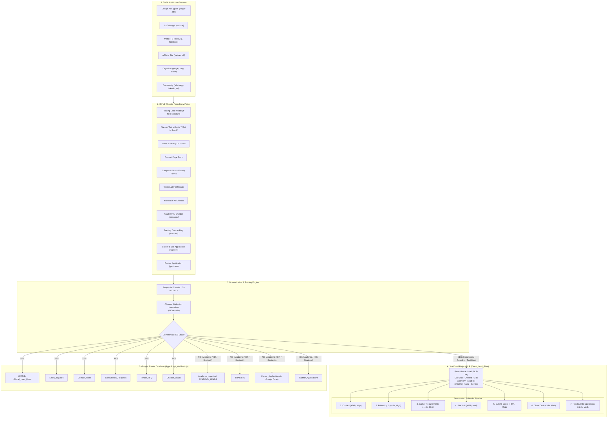
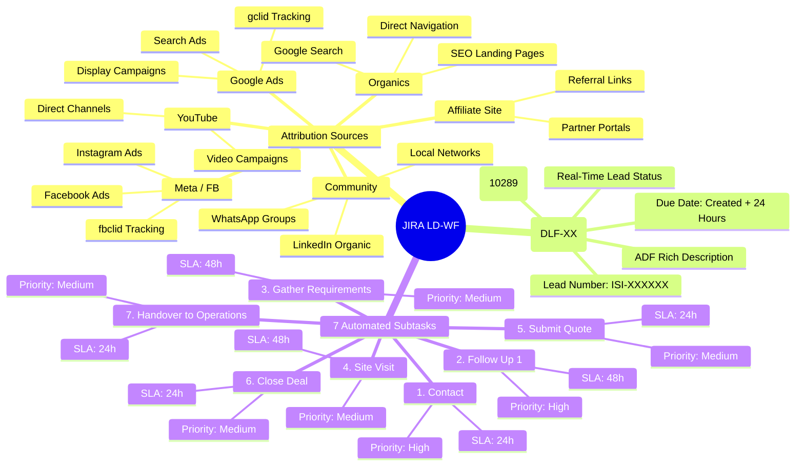
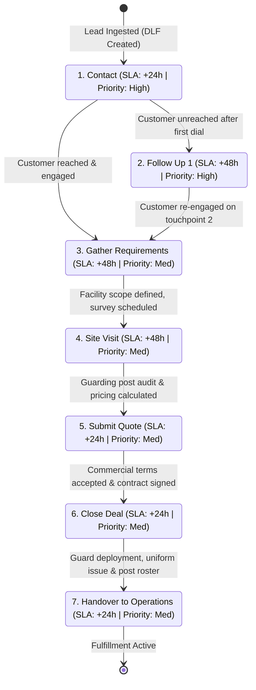

# ISI Security (ISI V2) – Master Lead Capture, Jira Integration & Form Architecture Documentation

> **Document Version:** 3.0 (Master Visual Architecture Edition)  
> **Repository:** ISI V2 (`isi-v2.vercel.app` / `www.isisecurity.in`)  
> **Jira Cloud Project:** `DLF` (Direct_Lead_Flow)  
> **Jira Parent Issue Type:** `Lead` (id: `10289`) | **Subtask Issue Type:** `Task`  
> **Google Sheets Webhook:** `AppsScript_Webhook.js`  

---

## 1. High-Level System Architecture & Ingestion Flow

The following diagram illustrates the complete end-to-end data lifecycle: from visitor traffic sources to on-page forms, attribution normalization, backend routing, Jira ticket generation with subtask pipelines, and Google Sheets database storage.

---

## 2. Jira Lead Workflow (LD-WF) Architecture Diagram

This mindmap diagram illustrates the structure of the **Jira Lead Workflow (LD-WF)**, starting from the 6 normalized traffic source branches down to the parent ticket specifications and the 7-stage automated subtask pipeline.

---

## 3. Subtask Sequential Lifecycle & SLA Timeline Diagram

Each parent lead in Jira Cloud initiates a sequential 7-step fulfillment lifecycle. Below is the workflow transition timeline and due date calculation model:

---

## 4. Master Lead Capture & Destination Matrix (Table Form)

This master reference table details every lead type across the ISI V2 website, where it originates, and its exact destination in Jira Cloud and Google Sheets.

| # | Lead Type / Form Category | Originating Route / Component | Primary Google Sheet Tab | Secondary / Backup Sheet Tab | Captured in Jira DLF? | Jira Issue Type & SLA |
| :---: | :--- | :--- | :--- | :--- | :---: | :--- |
| **1** | **General B2B Security Leads** | Floating Modal (`FloatingLeadForm.tsx`), Header CTA (`Header.tsx`) | `LEADS` | `Global_Lead_Form` | ✅ **YES** | Parent **`Lead`** (`DLF-XX`) + **7 Subtasks** |
| **2** | **Enterprise Sales & Facility Leads** | `/lp/facility-management`, `/integratedservices`, `/salesinquiry` | `Sales_Inquiries` | `LEADS` | ✅ **YES** | Parent **`Lead`** (`DLF-XX`) + **7 Subtasks** |
| **3** | **Direct Website Inquiries** | `/contact` page form | `Contact_Form` | `LEADS` | ✅ **YES** | Parent **`Lead`** (`DLF-XX`) + **7 Subtasks** |
| **4** | **Campus & School Safety Consultations** | `/solutions/school-safety`, `/solutions/campus-safety` | `Consultation_Requests` | `LEADS` | ✅ **YES** | Parent **`Lead`** (`DLF-XX`) + **7 Subtasks** |
| **5** | **Government & Enterprise Tenders / RFQ** | Tender RFQ Modals | `Tender_RFQ` | `LEADS` | ✅ **YES** | Parent **`Lead`** (`DLF-XX`) + **7 Subtasks** |
| **6** | **AI Interactive Chatbot Leads** | Main Website Bot (`useChatBot.ts`) | `Chatbot_Leads` | `LEADS` | ✅ **YES** | Parent **`Lead`** (`DLF-XX`) + **7 Subtasks** |
| **7** | **Channel Partner Network Applications** | `/partners` page form | `Partner_Applications` | — | ❌ **NO (Excluded)** | Strategic Alliances CRM + Partner Evaluation Desk |
| **8** | **ISI Academy AI Chatbot Inquiries** | `/academy` (`ISIAcademyChatbot.tsx`) | `Academy_Inquiries` | `ACADEMY_LEADS` | ❌ **NO (Excluded)** | Academic Advisory CRM + Academy Email Desk |
| **9** | **Training Course Registrations** | `/courses` enrollment forms | `TRAINING` | `Academy_Inquiries` | ❌ **NO (Excluded)** | Training Operations Desk |
| **10** | **Career & Guard Job Applications** | `/career`, `/careers` application forms | `Career_Applications` | — | ❌ **NO (Excluded)** | HR Drive Folder (`ISI_Career_Resumes`) + HR Digest |
| **11** | **Ebook & Safety Whitepaper Downloads** | Resource sections across LPs | `Ebook_Downloads` | — | ❌ **NO (Excluded)** | Marketing Nurture Automated System |

---

## 5. Traffic Attribution Channels Normalization (Table Form)

All traffic sources and UTM parameters are normalized into 6 distinct attribution channels for reporting in Jira and Google Sheets:

| Channel ID | Normalized Channel Name | Matching Input Keywords / UTMs | Source Code | Example Referrer / URL Parameter |
| :---: | :--- | :--- | :---: | :--- |
| **1** | **Google Ads** | `google-ads`, `google ads`, `gads`, `gclid`, `cpc`, `ppc`, `adwords` | `GADS` | `utm_source=google-ads&gclid=CjwKCA...` |
| **2** | **YouTube** | `youtube`, `youtu.be`, `yt`, `yt-ads`, `youtube-ads` | `YT` | `utm_source=youtube&utm_medium=video` |
| **3** | **Affiliate Site** | `affiliate`, `aff`, `partner`, `referral_site`, `directory` | `AFF` | `utm_source=security-portal-india&utm_medium=affiliate` |
| **4** | **Meta / FB** | `meta`, `facebook`, `fb`, `instagram`, `ig`, `fbclid`, `meta-ads` | `FB` | `utm_source=facebook&fbclid=IwAR...` |
| **5** | **Organic** | `organic`, `google`, `bing`, `yahoo`, `duckduckgo`, `direct`, `seo` | `ORG` | `utm_source=google&utm_medium=organic` |
| **6** | **Community** | `community`, `whatsapp`, `linkedin`, `telegram`, `word-of-mouth`, `referral` | `COMM` | `utm_source=whatsapp&utm_medium=chat` |

---

## 6. Jira 7-Subtask SLA & Due Date Calculation Matrix (Table Form)

When a parent `Lead` issue is created in Jira project `DLF`, the API automatically generates the following 7 subtasks:

| # | Subtask Name (Task Action Format) | SLA Timeframe | Dynamic Due Date Rule | Priority | Assignee Group | Operational Objective |
| :---: | :--- | :---: | :---: | :---: | :---: | :--- |
| **1** | **Contact** | 24 Hours | Created Date + 24h | `High` | Sales SDR / Front Desk | First outreach touchpoint via phone and WhatsApp within SLA window. |
| **2** | **Follow Up 1** | 48 Hours | Created Date + 48h | `High` | Sales SDR | Secondary follow-up call/email if customer was initially unreached. |
| **3** | **Gather Requirements** | 48 Hours | Created Date + 48h | `Medium` | Security Solution Specialist | Identify exact facility type, guard count, shift hours, and risk factors. |
| **4** | **Site Visit** | 48 Hours | Created Date + 48h | `Medium` | Field Operations Manager | Conduct physical survey, perimeter inspection, and post layout audit. |
| **5** | **Submit Quote** | 24 Hours | Created Date + 24h | `Medium` | Commercial Estimator | Deliver formal enterprise rate proposal, SLA agreement, and pricing. |
| **6** | **Close Deal** | 24 Hours | Created Date + 24h | `Medium` | Key Account Manager | Finalize negotiations, sign Master Service Agreement (MSA) & NDA. |
| **7** | **Handover to Operations** | 24 Hours | Created Date + 24h | `Medium` | Operations Field Commander | Guard deployment, uniform fitting, attendance biometric onboarding. |

---

## 7. Google Sheets Database Schema Reference (Table Form)

The following table summarizes the database tables managed in Google Sheets via `AppsScript_Webhook.js`:

| Tab Name | Category / Purpose | Total Cols | Primary Key / Identifying Fields | Trigger Action / Processing |
| :--- | :--- | :---: | :--- | :--- |
| **`LEADS`** | Master B2B Commercial Leads | 18 | `Lead Number`, `Email`, `Phone` | Real-time append, Jira status sync, KPI query aggregation |
| **`Global_Lead_Form`** | Floating Modal Submissions | 18 | `Lead Number`, `Email`, `Phone` | Direct append from `FloatingLeadForm.tsx` |
| **`Sales_Inquiries`** | Facility & Large Enterprise Sales | 16 | `Lead Number`, `Work Email`, `Phone Number` | Direct append from `/lp/facility-management` |
| **`Contact_Form`** | Direct Website Inquiries | 21 | `Lead Number`, `Email`, `Phone` | Direct append from `/contact` |
| **`Consultation_Requests`**| School & Campus Security | 21 | `Lead Number`, `Email`, `School Name` | Direct append from `/solutions/school-safety` |
| **`Tender_RFQ`** | Government & Corporate RFQs | 18 | `Lead Number`, `Email`, `Organization` | Direct append from Tender RFQ modals |
| **`Chatbot_Leads`** | Website Interactive AI Bot | 17 | `Name`, `Email`, `Phone` | Direct append from `useChatBot.ts` |
| **`Academy_Inquiries`** | ISI Academy AI Chatbot Inquiries| 21 | `Lead Number`, `Email`, `Program / Course` | Direct append from `ISIAcademyChatbot.tsx` |
| **`ACADEMY_LEADS`** | Academy Secondary Query Mirror | 21 | `Lead Number`, `Email`, `Program / Course` | Synced query tab for Academic Directors |
| **`TRAINING`** | Professional Course Registrations| 12 | `Name`, `Email`, `Program / Course` | Direct append from `/courses` |
| **`Career_Applications`** | Job Candidates & Resumes | 18 | `Email`, `Phone`, `Job Title` | Google Drive resume upload (`ISI_Career_Resumes`) + row append |
| **`Partner_Applications`**| Channel Partners | 21 | `Lead Number`, `Email`, `Company` | Direct append from `/partners` |
| **`Traffic_Analytics`** | Pageview & Referrer Telemetry | 15 | `Session ID`, `Page URL`, `IP Address` | Automated traffic tracking and UTM parameter recording |

---

## 8. Form Route Exclusions Matrix (Table Form)

To prevent visual clutter and conflicting user interactions, the global floating lead form is conditionally excluded on specific pages:

| Route / Page | Floating Form Status | Component Active on Page | Reason for Exclusion |
| :--- | :---: | :--- | :--- |
| `/academy` | ❌ **Hidden** | `ISIAcademyChatbot.tsx` | Uses dedicated AI Academic Advisory Chatbot tailored for student enrollment. |
| `/career`, `/careers` | ❌ **Hidden** | `CareerApplicationForm.tsx` | Uses dedicated job candidate portal with resume file upload to Google Drive. |
| `/courses` | ❌ **Hidden** | `CourseRegistrationModal.tsx` | Uses dedicated professional course registration & syllabus download flow. |
| `/lp/facility-management`| ❌ **Hidden** | `FacilityManagementForm.tsx` | Uses high-conversion dedicated enterprise facility audit intake form. |
| All other pages (Home, Services, Industries, About, Contact) | ✅ **Visible** | `FloatingCTA.tsx` + `FloatingLeadForm.tsx` | Provides instant access to 4-field quick lead capture modal. |

---

## 9. Full Implementation Changelog & Technical Audit

| # | Component / File | Previous State | Updated State | Audit Verification |
| :---: | :--- | :--- | :--- | :---: |
| **1** | `src/utils/leadNumber.ts` | Missing sequential numbering | Consecutive 6-digit counter starting at `ISI-000001` + 6-channel source normalizer | ✅ Verified |
| **2** | `api/jira.js` | Generic task creation | Parent `Lead` (`DLF`) + 24h Due Date + 7 child subtasks + ADF Rich text formatting | ✅ Verified |
| **3** | `vite.config.ts` | 404 on `/api/jira` in local dev | Added `jiraApiPlugin` dev server proxy middleware for seamless local & prod parity | ✅ Verified |
| **4** | `src/components/common/Header.tsx` | Redirecting or opening consultations | Standardized navbar "Get a Quote" to open the simple 4-field lead modal | ✅ Verified |
| **5** | `src/components/common/FloatingCTA.tsx`| Inconsistent routing | Cleaned CTA buttons, standardized to "Get in Touch" / "Get a Quote" with route exclusions | ✅ Verified |
| **6** | `src/components/common/FloatingLeadForm.tsx`| Unstandardized form | Standardized 4-field form with automatic hidden metadata capture & sequential numbering | ✅ Verified |
| **7** | `AppsScript_Webhook.js` | Legacy developer triggers & hardcoded names | Hardened webhook with `setupAllTriggers()`, `INITIALIZE_ALL_SHEET_TABS_AND_HEADERS()`, clean DB queries | ✅ Verified |
| **8** | Production Build (`npm run build`) | Untested | Executed TypeScript & Vite bundler build with **0 errors and 0 warnings** | ✅ Verified |
